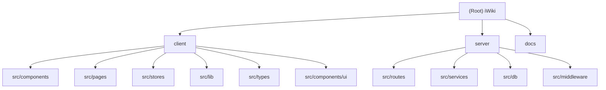

# iWiki - AI-Powered Knowledge Base

## Project Vision

iWiki is a full-stack wiki/knowledge-base application with built-in AI capabilities. It allows users to create, organize, and manage documents in a tree structure with rich Markdown editing (via Milkdown/Crepe). Key differentiating features include AI-powered semantic search (vector embeddings), an AI chat assistant that answers questions based on indexed documents, a commenting system, file uploads (images/videos), version history, and tag management.

The UI follows a dark developer-portfolio aesthetic with Cyan (#00BCD4) accents, using JetBrains Mono as the primary typeface.

## Architecture Overview

iWiki uses a classic client-server architecture:

- **Client**: Single-page React 19 application built with Vite, using React Router for navigation and Zustand for state management. The UI is styled with Tailwind CSS v4 and uses shadcn/radix-ui primitives. The editor is powered by Milkdown Crepe (a ProseMirror-based WYSIWYG Markdown editor).
- **Server**: Express 5 REST API running on Node.js with TypeScript. Uses better-sqlite3 for data storage (SQLite with WAL mode). Document content is stored as individual `.md` files on disk. AI features are powered by LangChain with OpenAI-compatible APIs.
- **Data**: SQLite database for metadata (nodes, versions, comments, sessions, embeddings). Filesystem for Markdown content and uploaded media.
- **AI Pipeline**: LangChain text splitter chunks documents into segments, generates embeddings via OpenAI API, stores them in SQLite as binary blobs. Semantic search uses cosine similarity. The chat feature uses Retrieval-Augmented Generation (RAG) with streaming responses via Server-Sent Events (SSE).

## Module Structure Diagram



## Module Index

| Module | Path | Language | Description |
|--------|------|----------|-------------|
| client | `client/` | TypeScript/React | Frontend SPA - React 19 + Vite + Tailwind CSS + Milkdown editor |
| server | `server/` | TypeScript/Node.js | Backend REST API - Express 5 + SQLite + LangChain AI |

## Running and Development

### Prerequisites

- Node.js (ES2022+)
- pnpm (v10.17.1)
- Environment variables configured in `.env` at project root (see below)

### Environment Variables (`.env`)

```
ADMIN_USERNAME=<admin username>
ADMIN_PASSWORD=<admin password>
JWT_SECRET=<jwt signing secret>
AI_API_KEY=<openai-compatible api key>
AI_API_BASE=<openai-compatible base url>
AI_CHAT_MODEL=gpt-4o
AI_EMBEDDING_MODEL=text-embedding-3-small
DATA_DIR=./data
PORT=3001
```

### Commands

| Command | Location | Description |
|---------|----------|-------------|
| `pnpm dev` | `client/` | Start Vite dev server on port 5173 (proxies `/api` and `/uploads` to server) |
| `pnpm build` | `client/` | TypeScript check + Vite production build |
| `pnpm lint` | `client/` | Run ESLint |
| `pnpm dev` | `server/` | Start server with tsx watch on port 3001 |
| `pnpm build` | `server/` | Compile TypeScript to `dist/` |
| `pnpm start` | `server/` | Run compiled server from `dist/` |

### Development Workflow

1. Start the server: `cd server && pnpm dev`
2. Start the client: `cd client && pnpm dev`
3. Open `http://localhost:5173` in a browser

The Vite dev server proxies API requests (`/api/*`) and upload paths (`/uploads/*`) to the backend at `localhost:3001`.

## Data Models

### Database Schema (SQLite)

- **nodes** - Document tree nodes (id, parent_id, title, icon, type, tags, sort_order, is_trash, timestamps)
- **versions** - Document version history (id, node_id, content, created_at)
- **comments** - Threaded comments (id, node_id, parent_id, nickname, content, is_deleted, created_at)
- **sessions** - JWT session tracking (id, expires_at)
- **embeddings** - Vector embeddings for semantic search (node_id, chunk_index, content, embedding as BLOB, updated_at)

### Filesystem

- `data/docs/<id>.md` - Markdown content files (one per document node)
- `data/uploads/` - Uploaded images and videos
- `data/wiki.db` - SQLite database file

## API Routes

| Method | Path | Auth | Description |
|--------|------|------|-------------|
| POST | `/api/auth/login` | No | Admin login |
| POST | `/api/auth/logout` | No | Admin logout |
| GET | `/api/auth/check` | Yes | Check auth status |
| GET | `/api/nodes` | No | List all nodes |
| GET | `/api/nodes/:id` | No | Get node with content |
| POST | `/api/nodes` | Yes | Create node |
| PUT | `/api/nodes/:id` | Yes | Update node metadata |
| PUT | `/api/nodes/:id/content` | Yes | Update document content |
| DELETE | `/api/nodes/:id` | Yes | Delete node and children |
| PUT | `/api/nodes/:id/trash` | Yes | Soft-delete (trash) node |
| PUT | `/api/nodes/:id/move` | Yes | Move node |
| PUT | `/api/nodes/reorder` | Yes | Batch reorder nodes |
| GET | `/api/nodes/:id/versions` | No | Get version history |
| GET | `/api/nodes/:id/versions/:versionId` | No | Get specific version |
| POST | `/api/nodes/:id/versions/restore` | Yes | Restore a version |
| GET | `/api/nodes/:nodeId/comments` | No | Get comments |
| POST | `/api/nodes/:nodeId/comments` | No | Create comment (guest) |
| DELETE | `/api/nodes/:nodeId/comments/:commentId` | Yes | Delete comment |
| GET | `/api/tags` | No | List all tags with counts |
| PUT | `/api/tags/rename` | Yes | Rename a tag |
| DELETE | `/api/tags/:name` | Yes | Delete a tag |
| GET | `/api/vector/stats` | No | Get embedding stats |
| POST | `/api/vector/index` | Yes | Build vector index |
| POST | `/api/vector/search` | No | Semantic search |
| POST | `/api/chat` | No | AI chat (SSE stream) |
| POST | `/api/uploads` | Yes | Upload file (image/video) |
| GET | `/uploads/:filename` | No | Serve uploaded files |
| GET | `/api/health` | No | Health check |

## Technology Stack

### Client
- React 19, React Router DOM 7, Zustand 5
- Vite 5, TypeScript 6
- Tailwind CSS 4, shadcn/ui (radix-nova style), Radix UI
- Milkdown Crepe 7 (ProseMirror-based Markdown editor)
- he-tree-react (drag-and-drop tree component)
- next-themes (dark/light mode)
- Lucide React (icons), Sonner (toasts), cmdk (command palette)
- ESLint with typescript-eslint

### Server
- Express 5, TypeScript 6
- better-sqlite3 (SQLite with WAL mode)
- LangChain (OpenAI chat + embeddings + text splitters)
- jsonwebtoken, cookie-parser (JWT auth)
- multer (file uploads)
- uuid (ID generation)
- tsx (dev runner)

## Testing Strategy

No test framework or test files are currently configured. This is a gap in the project. Recommended additions:
- Server: Vitest or Jest for unit/integration tests on routes and services
- Client: Vitest + React Testing Library for component tests

## Coding Standards

- **TypeScript strict mode** enabled on both client and server
- **ESLint** configured on client with `@eslint/js`, `typescript-eslint`, `react-hooks`, and `react-refresh` plugins
- **Path aliases**: `@/` maps to `client/src/` on the client side
- **API naming**: Server uses snake_case in DB/API; client transforms to camelCase via `toDocNode()`/`toComment()` helpers
- **Component patterns**: Functional components with hooks; Zustand store with selectors; shadcn/ui pattern for UI primitives
- **File organization**: Feature-based components; routes mirror API resource structure

## AI Usage Guidelines

- The AI chat feature uses RAG: documents are chunked, embedded, and stored. When a user asks a question, the system retrieves relevant chunks and feeds them as context to an LLM.
- The LLM provider is configurable via `AI_API_BASE` and `AI_API_KEY`, supporting any OpenAI-compatible API.
- Embeddings are stored as Float32 binary blobs in SQLite and cosine similarity is computed in-memory.
- The streaming chat endpoint uses Server-Sent Events (SSE).
- Be cautious when modifying the vector service: changes to chunk size/overlap or embedding model require a full index rebuild.

## Change Log (Changelog)

| Date | Change |
|------|--------|
| 2026-05-29 | Initial CLAUDE.md created by init-architect agent |
